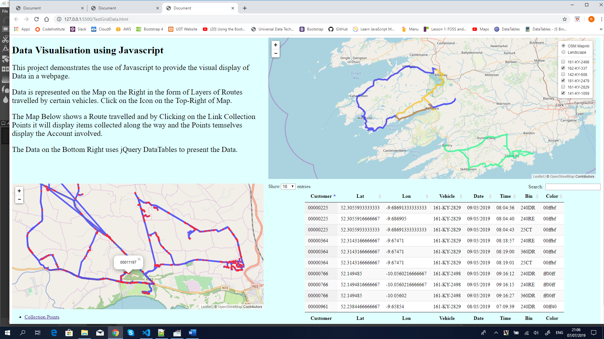

# Website for Data Visualization use Javascript
Stream Two Project: Interactive Frontend Development Milestone Project   - Code Institute 

This project demonstrates the use of Javascript to provide the visual display of Data in a webpage.  

Data is represented on the Map on the Right in the form of Layers of Routes travelled by certain  
vehicles. Click on the Icon on the Top-Right of Map.   

The Map on the Left shows a Route travelled and by Clicking on the link Collection Points it will display  
items collected along the way and the Points temselves display the Account involved.   

The Data on the Bottom Right uses jQuery DataTables to present the Data.  

  
## Demo
A live demo can be found https://rosstech.github.io/DataViz/.

## UX
My goal was to visually display data on a map.  I purposely used the OpenStreetMap mapping tools together with Leaflet js library to render the data.  
I also used the jQuery Datatables to display the data in tabular or Grid format.  This demonstrates the fetures included such as Sorting, Search and Pagination.  

## Technologies
1. HTML
2. CSS
3. Javascript

## Features
The Map on the top right has an Icon Control on the Top Right.  It permits switching of different mapping layers.  It also holds a list of Overlays layers that can toggle   
the display of the Vehicle routes on and off.

The Map on the Bottom displays a route and by clicking the "Collection Points" link the actual collections display on/off.  Clicking on a Dot will display the account number.  

## Testing
This site was tested on a Chrome browser and is primarily built for a Desktop display and as such responsiveness is not included.

## Deployment 
This site is hosted using GitHub pages, deployed directly from the master branch. The live site updates automatically each time there is a new push to the repository. You can `git clone` the code to run it locally on your machine.

## Credits
All source documents were delivered by the client.  

### Content
All content sections in this website come from source documents delivered by the client.

### Media 
No media files.

###Acknowledgements
Leaflet js - brilliant mapping framework
jQuery Datatables - super easy diplay od data in Grid format with sorting, searching and pagination buil in.
OpenStreetMap - open source mapping facility.

